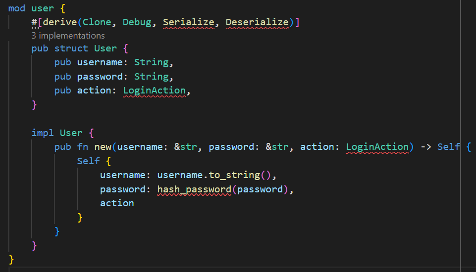
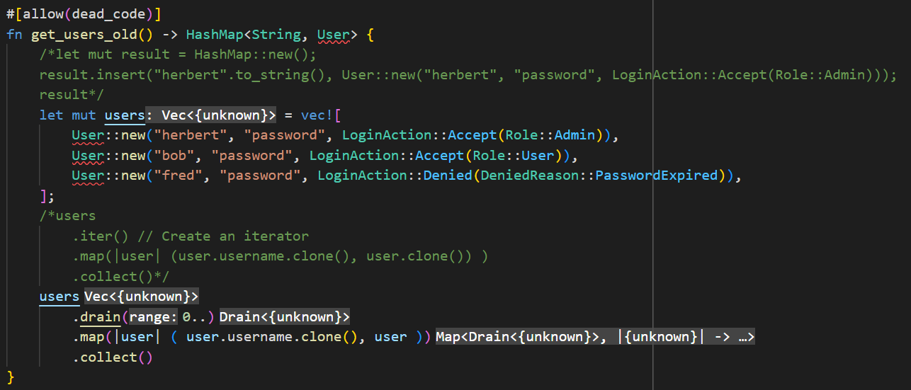

# Modules and Visibility

Our `authentication` system is getting pretty messy, and cleaning it up provides an opportunity to tackle one of the things that newcomers to Rust often find tricky at first---modules and visibility.

> We'll be live-coding this section. The GitHub source is [here](/src/modules1/). We'll also touch client code, represented in GitHub [here](/src/modules1_exe/)

So what is a module? A module is a way of grouping code together. It acts as a namespace. Modules also enforce privacy. You have very tight control over what can be accessed inside a module from the rest of your program. That's helpful for hiding implementation details, keeping users out of the parts you don't want them touching, and presenting a clean API to the outside world.

There's actually three different ways to build a module in Rust.

## Module Method 1: Using `mod` blocks

Let's move the `User` structure and its implementation into a module we declare with `mod`. You just have to wrap it in a `mod` block:

```rust
mod user {
    #[derive(Clone, Debug, Serialize, Deserialize)]
    pub struct User {
        pub username: String,
        pub password: String,
        pub action: LoginAction,
    }

    impl User {
        pub fn new(username: &str, password: &str, action: LoginAction) -> Self {
            Self {
                username: username.to_string(),
                password: hash_password(password),
                action
            }
        }
    }
}
```

You'll notice that Visual Studio Code has lit up like a Christmas tree with errors!



That's ok---this is what we're here for, learning how modules work. *Everything* that isn't in the module is now showing up as an error. That's because: **modules don't inherit `use` statements from their parent super-module**. 

Further down in `lib.rs`, you'll see that the rest of the code has developed a number of errors too:



These errors are occurring because `User` is no longer in the top-level module. **Modules don't automatically use anything in child modules**.

### Accessing Child Modules

In this case, resolving the top-level access to `User` is as simple as adding one line to the top of the `lib.rs` file:

```rust
use user::User;
```

> You can also replace every instance of `User` with `user::User` if you prefer.

The child module acts as a *namespace*.

### Imports Within a Module

Now let's fix the first set of errors. In VSCode, you can press `ctrl` plus `period` while on an error (or select "quick fixes" from the popup error). One of the suggestions is to "Import serde::Serialize". Let's do that. Notice that the import has appeared at the top of the *module* block:

```rust
mod user {
    use serde::{Serialize, Deserialize};

    #[derive(Clone, Debug, Serialize, Deserialize)]
    pub struct User {
        pub username: String,
        pub password: String,
        pub action: LoginAction,
    }

    impl User {
        pub fn new(username: &str, password: &str, action: LoginAction) -> Self {
            Self {
                username: username.to_string(),
                password: hash_password(password),
                action
            }
        }
    }
}
```

Let's fix access to `hash_password`. You actually have two choices here:
* `use super::hash_password` - you can always refer to the parent module as `super::`.
* `use crate::hash_password` - you can refer to the top of the current crate's tree as `crate::`.

And here it is, working again:

```rust
mod user {
    use serde::{Serialize, Deserialize};
    use crate::{LoginAction, hash_password};

    #[derive(Clone, Debug, Serialize, Deserialize)]
    pub struct User {
        pub username: String,
        pub password: String,
        pub action: LoginAction,
    }

    impl User {
        pub fn new(username: &str, password: &str, action: LoginAction) -> Self {
            Self {
                username: username.to_string(),
                password: hash_password(password),
                action
            }
        }
    }
}
```

### Access from Outside the Crate

Let's pop over to the `Login` program. We'll add one line of code:

```rust
let test = User::new("test", "test", LoginAction::Accept(Role::Admin));
```

Notice that it flags an error: `failed to resolve: use of undeclared type "User"`. This is despite us having a `use authentication::*` at the top of the file, `User` being marked as `pub`, and `use user::User` being in the top-level of your `lib.rs` file. This is happening because **modules are not exported by default**.

The module itself is private! If we change the `lib.rs` module declaration to:

```rust
pub mod user {
```

We still can't get to `User` in `main.rs`. If we change the line to:

```rust
let test = user::User::new("test", "test", LoginAction::Accept(Role::Admin));
```

We're importing `authentication` - and it has a *public* module named `user`. So we can get to `authentication::user::User` by accessing the public module. This is good if you're building a large library and want to separate the API into modules for your users. In this case, it's overkill---it's a very tightly focused library.

So let's undo the `pub mod` change and instead change `lib.rs` to:

```rust
pub use user::User;
```

We can change `main.rs` to read:

```rust
let test = User::new("test", "test", LoginAction::Accept(Role::Admin));
```

And `User` is now exported from the top-level of `lib.rs`, despite being declared in a module. This is a great option if you have your code divided into modules, but want to offer a simple API to library consumers.

### Struct Members Visibility

In `lib.rs`, the `login` function accesses the `password` field of the `User` structure. That's ok, because it's public:

```rust
pub password: String,
```

Let's change that to just `password: String,`. As expected, the `login` function complains that it can't access the `password` field. But what if we want to be able to access the field in `login`, but not from other programs? We can do that with `pub(crate)`:

```rust
pub(crate) password: String,
```

The `login` function can access `password` once again, but if you go over to `main.rs`---this fails:

```rust
let test = User::new("test", "test", LoginAction::Accept(Role::Admin));
println!("{}", test.password);
```

## Module Method 2: A Separate File

> We'll be live-coding this section. The GitHub source is [here](/src/modules2/).

Let's quickly undo our `mod user` change.

Many programmers---myself included---prefer to divide their code up into lots of files. There's some advantages to doing this:

* It's easier to read short files that keep similar content together.
* Compilation is faster---Cargo can divide compilation between files, allowing it to compile multiple parts of your program at once.

Let's create a new file in the `src` directory, named `user.rs`. We'll cut and paste the `User` structure and its implementation into the new file.

Notice that we immediately see some errors. Rust has no idea that `User` exists. If you look at `user.rs`---it's not showing any errors, despite there being some! That's because: **adding a file to the `src` folder does not make it part of the program.** This is deliberate, because in some cases you want to use conditional compilation to decide if a file should be included in the build at all.

You can add your `user.rs` file to your program by adding the following to `lib.rs`:

```rust
mod user;
```

And voila---`users.rs` is red. The errors are *exactly* what we ran into before. So in `lib.rs` add:

```rust
pub use user::User;
```

And at the top of `users.rs`, add:

```rust
use serde::{Serialize, Deserialize};
use crate::{LoginAction, hash_password};
```

Having a module inside a file---and referencing it with `mod <filename>;` is *exactly* the same as using a `mod` statement.

## Module Method 3: Multi-File Modules

Following the principle of "really short files", let's make a multi-file module holding our `Role`, `DeniedReason`, and `LoginAction` types. It's probably overkill to have one type per file, but it leaves room for growth.

In your `src` directory, create a new directory named `login_action`. In the new folder, create a file named `mod.rs`. Your directory structure now looks like this:

```
│   Cargo.toml
│
└───src
    │   lib.rs
    │   user.rs
    │
    └───login_action
            mod.rs
```

Now make another file, `role.rs` in the `src/login_action` directory and move `Role` into it. Do the same for `DeniedReason` and `LoginAction`.

As expected, errors appear! Once again, you have to add `login_action` to the project. In `lib.rs`, add:

```rust
mod login_action;
```

We *still* can't access the `LoginAction`, `Role` and `DeniedReason` types from `lib.rs`. That's because modules follow the same rules: they also need to be explicitly told to include files in your project.

So in `login_action/mod.rs`, add the following to enable the files:

```rust
mod denied_reason;
mod login_action;
mod role;
```

And now we have a *sea* of red error markers. In particular, we see lots of: `enum "crate::login_action::login_action::LoginAction" exists but is inaccessible`. In `lib.rs`, add the following:

```rust
pub use login_action::*;
```

It didn't help! Our `login_action` module isn't *exporting* anything, so its types are inaccessible. Add the following to `login_action/mod.rs`:

```rust
pub use denied_reason::DeniedReason;
pub use login_action::LoginAction;
pub use role::Role;
```

That's cleared up all the access issues in `lib.rs`. We still have to add some imports to the three child modules we created:

```rust
use serde::{Serialize, Deserialize};
```

The `action` file is still showing errors. It needs to import `Role` and `DeniedReason` from sibling modules:

```rust
use crate::{Role, DeniedReason};
```

We published them at the `crate` route, so we can access them that way. `super::` would also work.

Finally, notice that we're not relying on `Serialize` or `Deserialize` at the top of `lib.rs` anymore, so we can remove that line.

## Re-Exporting

Let's say that you expect everyone who uses your `authentication` library to need to be able to use Serde (as opposed to just having the library do it). You could mandate that they all add `serde` to their `Cargo.toml` file---or you could *re-export it*.

Open `lib.rs`, and add the following:

```rust
pub mod serde {
    pub use serde::*;
}
```

Now over in `main.rs` in the `login` program, we'll do a quick test (and then remove it):

```rust
use authentication::serde::Serialize;
```

Now your library users don't have to remember to add their own dependencies.

## Preludes

One last tip: it's common to create a module in your library's root named `prelude`, and `pub use` the important things you want to share in there. Nothing mandates it, but this convention makes it easy for users to find the important types.

> *It's Modules All The Way Down*. You can nest modules inside modules, inside more modules.